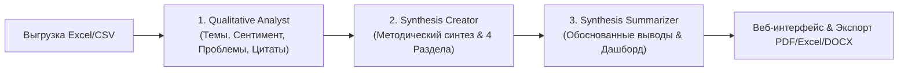

# Анализ отзывов слушателей — ИИ-Агент Учебной Аналитики

Интеллектуальная система учебной аналитики для автоматической обработки результатов анкетирования слушателей образовательных программ. Система автоматически превращает «сырые» выгрузки анкет (Excel / CSV) в готовую аналитическую справку, интерактивный дашборд с 5 обязательными визуализациями и обоснованный список рекомендаций методисту.

---

## Быстрый запуск для экспертов и судей (1 команда)

Проект настроен для **минимального количества действий** при развертывании. Скрипт автоматически создаст конфигурацию `.env`, скачает локальную GGUF нейросеть в папку `./models/` и запустит контейнеры Docker.

### Linux / macOS
```bash
git clone https://github.com/sqtwix/ai-review-analyzer.git
cd ai-review-analyzer
chmod +x deploy.sh
./deploy.sh
```

### Windows (PowerShell / CMD)
```cmd
git clone https://github.com/sqtwix/ai-review-analyzer.git
cd ai-review-analyzer
deploy.bat
```

После выполнения скрипта откройте веб-интерфейс в браузере:
**[http://localhost/](http://localhost/)**

---

## Системные требования

### Минимальные требования (Offline Local CPU):
* **Процессор**: 4 ядра x86_64 / ARM64
* **Оперативная память (RAM)**: 8 ГБ
* **Свободный диск**: 10 ГБ SSD
* **ПО**: Docker / Docker Desktop

### Рекомендуемые требования (Для высокой скорости):
* **Процессор**: 8 ядер CPU или видеокарта с **4 ГБ VRAM** (NVIDIA CUDA / Apple Silicon Metal)
* **Оперативная память (RAM)**: 16 ГБ
* **Свободный диск**: 20 ГБ SSD

---

## Как это работает

Система построена на архитектуре гибридного ИИ-агента с трехэтапным конвейером обработки:



### Поддержка 2 режимов работы нейросетей:
1. **100% On-Premise / Offline режим**: Запуск локальной квантованной модели `Qwen` через `llama.cpp` на CPU/GPU без передачи данных во внешнюю сеть.
2. **Enterprise Cloud AI**: Поддержка российских и мировых облачных моделей (`GigaChat / SberGPT`, `DeepSeek`).

---

## Основные функции

### 1. Статистический и числовой анализ (Модуль 1 ТЗ)
* Автоматический расчет средних арифметических, медиан и стандартных отклонений по 4 числовым критериям: **Полезность, Практика, Доступность, Взаимодействие с КУ**.
* Расчет индекса психологической вовлеченности (процент вовлеченных и отстраненных слушателей).
* Распределение оценок по 3 корзинам: **1–3 (Низкая)**, **4–7 (Средняя)**, **8–10 (Высокая)**.

### 2. Обязательные визуализации дашборда (Модуль 3 ТЗ)
* **Линейчатая диаграмма**: Средние баллы по 5 критериям с цветовыми градиентами.
* **Спайдер-график (лепестковая диаграмма)**: Профиль удовлетворенности по 5 осным векторам.
* **Тепловая карта корреляций**: 4x4 матрица коэффициентов Пирсона с поворотом заголовков для удобства чтения.
* **Столбчатая диаграмма**: Распределение общей оценки (1–3, 4–7, 8–10).
* **График тренда**: Динамика оценок по нескольким периодам/потокам обучения.

### 3. Текстовый NLP-анализ отзывов (Модуль 2 ТЗ)
* **Тематическое моделирование**: Выделение топ-5–7 ключевых тем отзывов с частотой упоминания.
* **Сентимент-анализ**: Процентный баланс позитивных, нейтральных и негативных комментариев.
* **Критичные проблемы**: Выделение проблем с уровнем риска (High, Medium, Low) и долей упоминаний.
* **Цитатный ряд**: Репрезентативные выдержки из ответов слушателей с частотными тегами.
* **Поисковый фильтр**: Интерактивный поиск по ключевым словам среди всех отзывов и цитат.

### 4. Аналитическая справка и выводы (Модуль 4 ТЗ)
Справка формируется в 4 обязательных разделах:
1. **Общая информация о программе** (демография, периоды, число респондентов).
2. **Анализ ключевых критериев** (табличные данные + текстовые резюме).
3. **Предложения слушателей** (неактуальные темы для исключения, темы для добавления с числом запросов, предпочтительные форматы).
4. **Траектория изменения программы** (приоритетные выводы со ссылками на данные, например: `(34% отзывов, N=14)`).

### 5. Мультиформатный экспорт
Мгновенное скачивание результатов в форматах: **PDF**, **Excel** (многостраничная книга с расчетами), **DOCX**, **CSV**, **JSON**.

---

## Безопасность и конфиденциальность

* **100% Автономность (Air-Gapped)**: В локальном режиме модель `qwen_local` исполняется на сервере предприятия. Ни один байт данных не покидает корпоративный контур.
* **Автоматическое обезличивание**: Парсер [FileParser.cs](file:///c:/Users/ivan2/ai-review-analyzer/api-core/ApiCore/ApiCore/Services/FileParser.cs) автоматически маскирует регулярными выражениями персональные данные:
  * Email-адреса $\rightarrow$ `[email]`
  * Телефоны $\rightarrow$ `[телефон]`
  * СНИЛС $\rightarrow$ `[СНИЛС]`
  * Паспортные данные $\rightarrow$ `[паспорт]`
  * Номера банковских карт $\rightarrow$ `[карта]`
* **Изоляция данных пользователей**: Каждая задача привязана к GUID авторизованного пользователя через JWT Bearer токены. Доступ к чужим отчетам невозможен.
* **Гарантированная отказоустойчивость**: Программный fallback-движок гарантирует 100% генерацию отчета даже при сбоях внешних моделей.

---

## Ручное развертывание через Docker Compose

Если вы предпочитаете запустить контейнеры вручную:

1. Скопируйте файл переменных окружения:
   ```bash
   cp env_example.txt .env
   ```
2. Создайте папку для моделей и скачайте локальную нейросеть:
   ```bash
   mkdir -p models
   curl -L -o models/Qwen3.5-0.8B-Q8_0.gguf https://huggingface.co/Qwen/Qwen2.5-0.5B-Instruct-GGUF/resolve/main/qwen2.5-0.5b-instruct-q8_0.gguf
   ```
3. Соберите и запустите сервис:
   ```bash
   docker compose up --build -d
   ```
4. Откройте приложение: **http://localhost/**

---

## Структура проекта

```text
ai-review-analyzer/
├── deploy.sh                     # Скрипт авторазвертывания Linux/macOS
├── deploy.bat                    # Скрипт авторазвертывания Windows
├── docker-compose.yml            # Конфигурация Docker контейнеров
├── env_example.txt               # Шаблон переменных окружения
├── models/                       # Папка для GGUF моделей нейросетей
├── api-core/                     # Backend на .NET 9 (C# Web API + Entity Framework)
├── ai-driver/                    # Python FastAPI микросервис ИИ-агентов (LangChain/llama.cpp)
├── frontend/                     # Frontend на React + Vite + Vanilla CSS
└── task_doc/                     # Документация и ТЗ кейс-чемпионата
```
